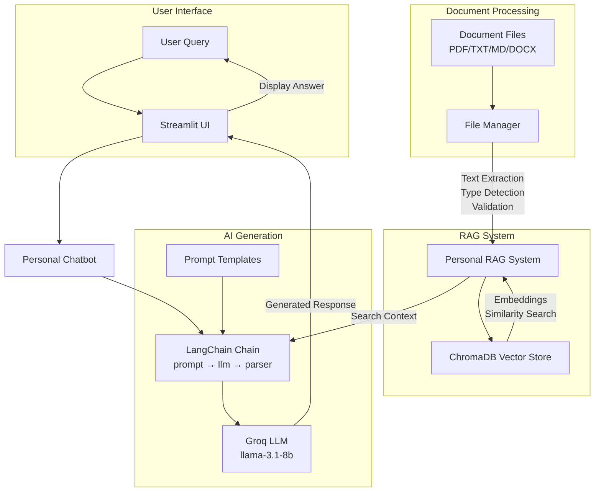

# EchoCV
A resume that talks 😯

## Overview

EchoCV creates an AI assistant that knows everything about your professional background. Instead of static resumes, visitors can have natural conversations to learn about your skills, experience, and projects.

## Features

### Core Functionality
- **Interactive Resume Chat**: Visitors can ask questions and get personalized responses about my background
- **Document Processing**: Automatically processes PDFs, Word docs, text files from personal data
- **Smart Search**: Vector-based semantic search through my professional information
- **Configurable Identity**: Easy name and personal information management

## System Architecture




### Technical Implementation
- **RAG Architecture**: ChromaDB vector database with HuggingFace embeddings
- **Modern LangChain**: LCEL chains with prompt templating system
- **File Management**: Centralized text extraction and document processing
- **Web Interface**: Clean Streamlit application for public interaction

## Installation

1. **Clone Repository**
   ```bash
   git clone https://github.com/rapha-pro/EchoCV
   cd echocv
   ```

2. **Install Dependencies**
   ```bash
   pipenv install
   pipenv shell
   ```

3. **Environment Setup**
   ```bash
   touch .env
   # Add your `GROQ_API_KEY`
   ```

4. **Add Personal Documents**
   ```
   data/personal_data/
   ├── resume.pdf
   ├── projects.md
   ├── skills.txt
   └── education.txt
   ```

## Configuration

### Personal Information
Update `.env` with your details:
```bash
GROQ_API_KEY=your_api_key_here

PERSONAL_FIRST_NAME=John
PERSONAL_LAST_NAME=Doe
PERSONAL_EMAIL=john@example.com
```

### Customize Name
Edit `streamlit_app/personal_ai_assistant.py`:
```python
NAME = "Your Name"  # Change this line
```

## Usage

### Run Web Application
```bash
streamlit run streamlit_app/main.py
```

### Test RAG System
```bash
python rag_system/personal_rag.py
```

### Test Chatbot
```bash
python integration/personal_chatbot.py
```

## Project Structure

```
echocv/
├── data/
│   └── personal_data/          # Your documents (PDF, TXT, MD)
├── rag_system/
│   └── personal_rag.py         # Core RAG implementation
├── integration/
│   ├── personal_chatbot.py     # LangChain chatbot
│   └── prompts/                # Prompt templates
├── utility/
│   ├── file_manager.py         # Document processing
│   └── text_styles.py          # Terminal formatting
├── streamlit_app/
│   └── personal_ai_assistant.py # Web interface
└── automation/
    └── document_manager.py      # File organization
```

## Document Types Supported

- **Resume/CV**: PDF, DOCX, TXT
- **Projects**: Markdown, text descriptions
- **Skills**: Technical competencies, tools
- **Education**: Degrees, certifications, courses
- **Personal Statements**: Cover letters, bios

## Use Cases

### For Job Seekers
- Interactive portfolio that stands out
- 24/7 availability for recruiter questions
- Consistent messaging about your background

### For Professionals
- Networking tool for conferences and events
- Personal knowledge management system
- Interview preparation assistant

### For Recruiters
- Quick assessment of candidate fit
- Natural language queries about experience
- Deeper insight than traditional resumes

## Technical Details

### RAG Pipeline
1. **Document Ingestion**: File Manager extracts text from various formats
2. **Chunking**: Text split into semantic chunks with overlap
3. **Embedding**: HuggingFace sentence-transformers create vector representations
4. **Storage**: ChromaDB stores vectors with metadata
5. **Retrieval**: Semantic search finds relevant context
6. **Generation**: LangChain chain combines context with user query

### LLM Integration
- **Provider**: Groq (fast inference)
- **Model**: llama-3.1-8b-instant
- **Framework**: LangChain with LCEL syntax
- **Prompt Engineering**: Template-based with FileManager

## Performance

- **Response Time**: Sub-second for most queries
- **Accuracy**: Context-aware responses based on your actual documents
- **Scalability**: Handles hundreds of document pages
- **Reliability**: Persistent vector storage with automatic reloading

## Contributing

1. Fork the repository
2. Create feature branch
3. Add tests for new functionality
4. Submit pull request

## License

MIT License - see LICENSE file for details
